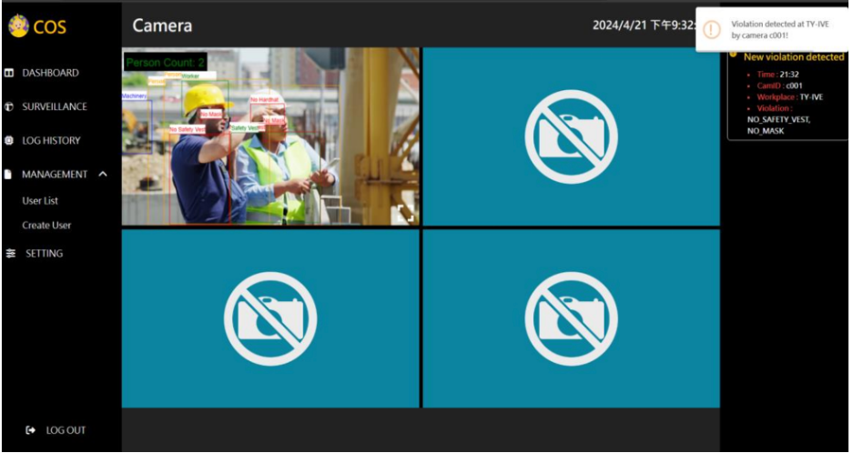
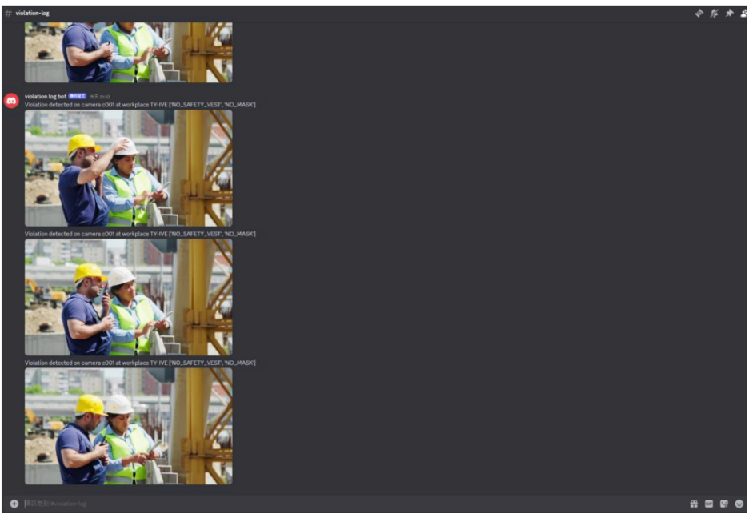

# 🏗️ Smart Construction Site – AI-Powered Safety Monitoring System

This is the Final Year Project for the Higher Diploma in Software Engineering at the Hong Kong Institute of Vocational Education (Tsing Yi). The project introduces an AI-powered real-time monitoring system for construction site safety.

## 📌 Project Overview

The system is designed to detect and report safety violations using AI models and computer vision. It identifies whether workers wear the appropriate safety gear (e.g., helmets, masks, safety vests) and detects fire hazards using IP camera feeds and real-time processing.

## 🧠 Technologies Used

| Component        | Technology             |
|------------------|------------------------|
| Object Detection | YOLOv8 (PyTorch)       |
| Image Processing | OpenCV                 |
| Backend API      | Golang Fiber           |
| Data Streaming   | gRPC                   |
| Communication    | Discord API            |
| Database         | SurrealDB              |
| Frontend         | HTML/CSS + JS (jQuery) |
| Architecture     | Distributed System     |

## 🛠️ Features

- **Object Detection**: Helmets, safety masks, vests, people, machinery, vehicles, fire
- **Helmet Color Role Classification**: Identify roles based on helmet colors
- **Alert System**: Real-time safety alerts via Discord
- **User Management**: Create, edit, delete user accounts
- **Data Reporting**: Weekly/monthly violation summaries
- **Log History**: Full violation log with timestamps
- **Real-Time Monitoring**: Surveillance with web UI
- **Backup & Security**: Daily data backup and Argon2-hashed passwords

## 🗂️ System Architecture

Three-tier distributed system:
- **Presentation Layer**: HTML & browser UI
- **Application Layer**: Golang Fiber web server, PyTorch inference server
- **Data Layer**: SurrealDB for storage, Discord API for alerts

## ⚙️ How It Works

1. **Cam Server** captures real-time video feed and encodes images to Base64
2. **Web Server** receives images via gRPC and waits for frontend requests
3. **Inference Server** decodes and runs YOLOv8 object detection
4. **Discord Alerts** are triggered on violation detection
5. **SurrealDB** logs violations and timestamps
6. **Frontend** polls server and renders real-time results

## System Flow Chart

## 🖼️ UI Showcase - Partial

### Login

### Dashboard

### Object detection and on-screen violation alert

### Discord notification alert example

### Adjust setting

